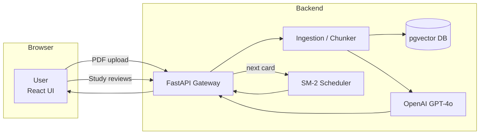
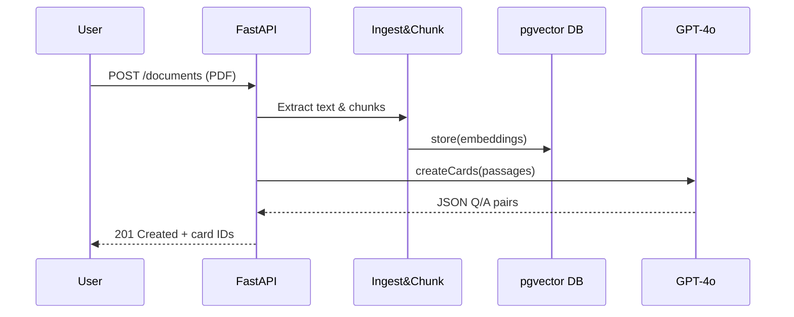

# 📚 Spaced-Repetition Tutor

> **Mission:** Turn any lecture PDF into high-quality flashcards in seconds and schedule them with a proven spaced-repetition algorithm so students remember ≥ 80 % of what they study.

---

## 1 · Problem Statement
Students lose **2-3 h per week** manually writing flashcards and still forget 60 % of the material within a month.  
We need a tool that **automates card creation** and **optimizes review timing** so learners spend their time recalling—not typing.

## 2 · Solution Overview
1. **Ingest** a PDF, extract text, and chunk it into ~200-token passages.  
2. **Embed** each passage with `text-embedding-3-small`; store vectors in Postgres + pgvector.  
3. **Generate** strict-JSON *Q/A pairs* via GPT-4o function-calling.  
4. **Schedule** reviews with an SM-2 variant; surface the next card via `/next`.  
5. **Measure** learning outcomes and system KPIs (see §3).

## 3 · Definition of Success (v1)
| Metric | Target | Notes |
|--------|--------|-------|
| 🌟 **Recall accuracy** 1 week post-study | **≥ 80 %** | Avg. correct answers / total reviews |
| ⚡ **Flashcard generation latency** | **\< 30 s** end-to-end | p95 |
| 🔁 **Duplicate-card rate** | **\< 5 %** | Jaccard > 0.8 counts as dup |
| 📈 **Monthly active users (MAU)** | **≥ 100** beta testers | after public launch |
| 🕒 **Review API latency** | **\< 200 ms** p95 | on Fly.io |

## 4 · High-Level Architecture

## 5 · Sequence Diagram – “Generate Flashcards”

## 6 · Entity-Relationship Diagram
``` mermaid
erDiagram
    USER ||--o{ DOCUMENT : uploads
    DOCUMENT ||--o{ PASSAGE : contains
    PASSAGE ||--|| EMBEDDING : has
    PASSAGE ||--o{ FLASHCARD : "generates"
    USER ||--o{ REVIEW : "reviews"
    FLASHCARD ||--o{ REVIEW : "in"
| Entity        | Key fields                                                       |
| ------------- | ---------------------------------------------------------------- |
| **User**      | `id`, `email`, `created_at`                                      |
| **Document**  | `id`, `user_id`, `title`, `source_url`                           |
| **Passage**   | `id`, `document_id`, `text`, `order`                             |
| **Embedding** | `passage_id`, `vector[1536]`                                     |
| **Flashcard** | `id`, `passage_id`, `question`, `answer`                         |
| **Review**    | `id`, `user_id`, `flashcard_id`, `ease`, `next_due`, `timestamp` |
```
## 7 · Tech Stack
- Backend: FastAPI · Python 3.12 · Uvicorn
- LLM / Embeddings: OpenAI GPT-4o + text-embedding-3-small
- DB: Postgres 16 + pgvector (Supabase)
- Front-end: React + Vite · TailwindCSS
- Auth: Supabase Auth (JWT)
- Infra: Fly.io · Docker · GitHub Actions
- Observability: PostHog (events) · Grafana Cloud (traces/alerts)
